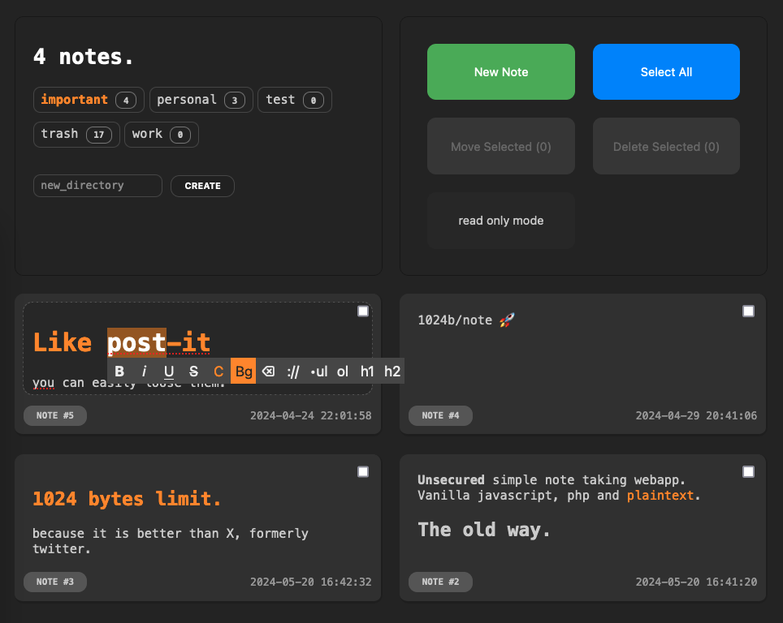

# q.notes

q.notes is a simple note taking webapp made with vanilla javascript and php.
no database, just plaintext files with some html tags.

## install
- copy files to your php webserver. e.g., /www/notes/
- check permissions.
- go to your server url. e.g., http://127.0.0.1/notes
- secure the folder if needed. e.g., password protecting with .htaccess
- take notes.

## config
edit config.php
